# Architecture Specification (AcademyOS)

Documento canônico de arquitetura do monorepo AcademyOS (LMS + Simulador Nexa). Última auditoria: **2026-06-20**.

---

## 1. Topologia do Monorepo

### 1.1 Diagrama de relacionamento entre pacotes

```mermaid
flowchart TB
  subgraph apps["apps/"]
    LMS["apps/lms<br/>Next.js 16 · porta 3000"]
    SIM["apps/simulator<br/>Next.js 16 · porta 3001"]
  end

  subgraph packages["packages/"]
    UI["@academyos/ui<br/>Design System + Markdown/Mermaid"]
    AUTH["@academyos/auth<br/>Auth.js / NextAuth v5"]
    DB["@academyos/database<br/>Prisma + Neon adapter"]
    TYPES["@academyos/types<br/>DTOs compartilhados"]
    STORE["@academyos/store<br/>Zustand"]
    CFG["@academyos/config<br/>ESLint + TSConfig"]
    DS["@academyos/dataset-tools<br/>Scripts offline"]
  end

  subgraph external["Dependências externas (hoje no Simulator)"]
    SUPA["Supabase Auth + PostgREST"]
  end

  LMS --> UI
  LMS --> AUTH
  LMS --> DB
  LMS --> TYPES
  LMS --> STORE
  LMS --> CFG

  SIM -.->|"meta: integrar"| UI
  SIM -.->|"meta: integrar"| AUTH
  SIM -.->|"meta: integrar"| DB
  SIM -.->|"meta: integrar"| STORE
  SIM --> SUPA
  SIM -.->|"globals.css importa UI sem dep declarada"| UI

  AUTH --> DB
  TYPES --> DB
  DS --> DB
  UI --> CFG

  style SIM fill:#3a3b3d,stroke:#ffd369
  style SUPA fill:#7f1d1d,stroke:#ef4444
```



**Legenda:** linhas sólidas = dependência real hoje; linhas tracejadas = estado alvo ou dependência frágil.

### 1.2 Inventário de pacotes

| Pacote | Responsabilidade | Consumidores atuais |
|--------|------------------|---------------------|
| `@academyos/ui` | Componentes, tema (`globals.css`), Markdown + Mermaid client-side | `lms` (parcial); `simulator` (só CSS via import) |
| `@academyos/auth` | Auth.js, Prisma adapter, RBAC (`requireRole`) | `lms` |
| `@academyos/database` | Prisma schema, singleton Neon | `lms`, `auth`, `types`, `dataset-tools` |
| `@academyos/types` | DTOs (`QuestionPayload`, `AttemptResult`) | `lms` (declarado; uso mínimo) |
| `@academyos/store` | Zustand (`simulator-store`) | `lms` (declarado; **não usado**) |
| `@academyos/config` | ESLint Next + tsconfig base/next | `lms`, `ui` |
| `@academyos/dataset-tools` | Importação/auditoria de questões offline | Nenhum app (scripts isolados) |

### 1.3 Aplicativos

| App | Nome npm | Porta dev | Stack efetiva |
|-----|----------|-----------|---------------|
| LMS | `lms` | 3000 | NextAuth + Prisma + `@academyos/ui` |
| Simulador | `simulados-app` | 3001 | Supabase Auth + PostgREST + UI local duplicada |

---

## 2. Regras obrigatórias de importação

### 2.1 Matriz de dependências permitidas

| Origem | Pode importar | Não pode importar |
|--------|---------------|-------------------|
| `apps/*` | `@academyos/ui`, `@academyos/auth`, `@academyos/database`, `@academyos/types`, `@academyos/store`, `@academyos/config` | Outro `apps/*`; `@academyos/dataset-tools` em runtime |
| `@academyos/ui` | `@academyos/config` (dev), peers (`react`) | `@academyos/database`, `@academyos/auth`, `apps/*` |
| `@academyos/auth` | `@academyos/database` | `@academyos/ui`, `apps/*` |
| `@academyos/database` | Prisma / Neon | Qualquer outro `@academyos/*` |
| `@academyos/types` | `@academyos/database` (tipos) | `@academyos/ui`, `apps/*` |
| `@academyos/store` | `zustand` | `@academyos/database`, `@academyos/ui` |
| `@academyos/dataset-tools` | `@academyos/database` | `apps/*` (apenas CLI offline) |

**Dependências circulares:** não há ciclo entre pacotes workspace hoje (`auth → database`, `types → database`). O risco futuro é `database` importando `types` — **proibido**.

### 2.2 Padrões de import por pacote

```ts
// UI — sempre via subpath export
import { Button } from "@academyos/ui/button";
import { MarkdownText } from "@academyos/ui/markdown";
import "@academyos/ui/styles/globals.css"; // apenas em globals.css do app

// Database — singleton, nunca new PrismaClient() no app
import { prisma } from "@academyos/database";

// Auth — barrel público (não deep import)
import { auth, signIn, signOut } from "@academyos/auth";
import { requireRole } from "@academyos/auth/requireRole"; // exportar explicitamente

// Store
import { useSimulatorStore } from "@academyos/store/simulator";

// Types
import type { QuestionPayload } from "@academyos/types";
```

### 2.3 Proibições explícitas

1. **Deep imports** em caminhos internos (`@academyos/auth/src/requireRole`, `@academyos/ui/src/...`).
2. **Duplicar componentes UI** em `apps/*/src/components/ui` — usar `@academyos/ui`.
3. **Instanciar `PrismaClient`** fora de `@academyos/database` (viola singleton Neon + HMR).
4. **Cores Nexa hardcoded** (`#171819`, `#FFD369`) em componentes — usar tokens CSS (`--primary`, `--ct-yellow`, etc.).
5. **Scripts de dataset** ou dumps JSON em `apps/` — usar `packages/dataset-tools/data/`.
6. **Lógica de domínio** (scoring, seleção adaptativa, validação de resposta) em Client Components.

### 2.4 Camadas no Simulador (DDD alvo)

```
apps/simulator/src/
  domain/          # Entidades, regras puras (sem React, sem Supabase)
  application/     # Use cases (createSimulation, finishSimulation)
  infrastructure/  # Repositórios Prisma/Supabase
  app/             # Next.js routes, Server Actions (orquestração fina)
  components/      # Apresentação (props tipadas, zero regra de negócio)
```

Hoje a lógica está parcialmente em `lib/adaptive/selection.ts` (bom) e parcialmente em `components/simulations/quiz-runner.tsx` (violação).

---

## 3. Decisões arquiteturais (fechadas)

1. **Monorepo Turborepo + pnpm** desde o dia 1.
2. **Conteúdo de aulas no PostgreSQL** como JSON Tiptap; Markdown só na importação.
3. **RBAC:** `ADMIN`, `INSTRUCTOR`, `STUDENT` + `Organization`.
4. **Integração LMS ↔ Simulator** por navegação direta (sem iframe/postMessage), sessão compartilhada.
5. **Deploy MVP Vercel** com Prisma Neon serverless; portabilidade via Docker (`infra/docker/`).

### 3.1 Estado de convergência (auth + banco)

**Meta (documentada no SKILL):** um PostgreSQL via Prisma, Auth.js no LMS e Simulador, cookie compartilhado no apex domain.

**Estado atual:** o Simulador ainda usa **Supabase Auth + schema próprio** (`simulations`, `user_question_stats`, `profiles`). O Prisma em `packages/database` modela `Question`, `Attempt`, `Assessment` com estrutura **incompatível** (UUID vs bigint, campos diferentes). Existe script `dataset-tools/migrate-from-supabase.ts` para migração, mas o app não foi migrado.

### 3.2 Persistência de aulas (Tiptap)

- `Lesson.content` como `Json` no Prisma.
- Import MDX via `apps/lms/src/app/api/import-mdx` (remark → Tiptap JSON), não em runtime.

---

## 4. Design System (`@academyos/ui`)

### 4.1 Tema centralizado

- Tokens em `packages/ui/src/styles/globals.css` (Tailwind v4 `@theme inline` + variáveis Nexa `--ct-*`).
- Apps devem: `@import "tailwindcss"` → `@import "@academyos/ui/styles/globals.css"` → `@source` para scan do pacote UI.
- Apps **não** devem redefinir paleta primária; exceções locais (ex.: sidebar LMS) devem usar tokens ou extensão documentada.

### 4.2 Dark mode e tipografia (requisito premium Nexa)

| Aspecto | Estado atual | Meta |
|---------|--------------|------|
| Dark mode | LMS: `class="dark"` fixo; Simulator: fundo hardcoded | `ThemeProvider` + toggle; contraste alto via tokens |
| Fontes LMS | Geist Sans / Mono | Plus Jakarta Sans + JetBrains Mono (identidade Nexa) unificada |
| Fontes Simulator | Plus Jakarta + JetBrains | Alinhar com pacote UI |
| Componentes portados Nexa-Frontend | Muitos em `ui/src/components/` com imports `@/presentation` quebrados | Refatorar paths relativos ou remover do export até estável |

### 4.3 Markdown + Mermaid (LMS + Simulator)

Implementação centralizada em `@academyos/ui/markdown`:

- `"use client"` + `import("mermaid")` dinâmico — compatível com SSR do Next.js.
- Blocos ` ```mermaid ` detectados via componentes `pre`/`code` do `react-markdown` (sem depender de `inline`).
- Tema Nexa via `mermaid-config.ts` (`theme: base` + `themeVariables`), reagindo à classe `.dark` no `<html>`.
- IDs estáveis com `useId()`; `bindFunctions` após render; fallback visual em caso de erro de sintaxe.
- Estilos em `globals.css` (`.mermaid-diagram`).

O Simulador reexporta `@academyos/ui/markdown` em `components/ui/markdown-text.tsx`.

---

## 5. Relatório de Gaps Arquiteturais

Severidade: 🔴 crítico · 🟠 alto · 🟡 médio · 🟢 baixo

### 5.1 Monorepo / Turborepo

| ID | Gap | Severidade | Princípio violado |
|----|-----|------------|-------------------|
| G-01 | `apps/simulator` não declara deps workspace (`@academyos/ui`, etc.) mas importa CSS do UI | 🔴 | Integração monorepo |
| G-02 | Nome npm `simulados-app` vs filtro `simulator` no root `package.json` | 🟡 | Consistência tooling |
| G-03 | `package-lock.json` no Simulator dentro de monorepo pnpm | 🟠 | Single package manager |
| G-04 | Dumps JSON e scripts duplicados em `apps/simulator/` e `packages/dataset-tools/` | 🟠 | Separação de concerns |
| G-05 | `@academyos/auth` e `@academyos/database` sem campo `exports` | 🟡 | Encapsulamento |
| G-06 | Deep import `@academyos/auth/src/requireRole` no LMS | 🟠 | SOLID / boundaries |
| G-07 | `apps/lms/next.config.ts` referencia `@academyos/supabase` inexistente | 🔴 | Build correctness |

### 5.2 Auth e banco de dados

| ID | Gap | Severidade | Princípio violado |
|----|-----|------------|-------------------|
| G-08 | Dual stack: NextAuth+Prisma (LMS) vs Supabase (Simulator) | 🔴 | Decisão arquitetural SKILL |
| G-09 | Schemas incompatíveis: Prisma `Question`/`Attempt` vs Supabase `simulations`/`user_question_stats` | 🔴 | Single source of truth |
| G-10 | `progress.ts` cria `new PrismaClient()` sem Neon adapter | 🔴 | Next.js serverless / conexões |
| G-11 | `detran-content.ts` e scripts usam `PrismaClient` direto | 🟠 | Singleton |
| G-12 | LMS `lib/supabase/server.ts` é stub fake — legado confuso | 🟡 | Clareza |

### 5.3 DDD / SOLID (Simulador)

| ID | Gap | Severidade | Princípio violado |
|----|-----|------------|-------------------|
| G-13 | `quiz-runner.tsx` contém normalização de resposta e validação de completude | 🟠 | DDD — domínio na UI |
| G-14 | `lib/server/simulations.ts` mistura repositório + orquestração (500+ linhas) | 🟠 | SRP |
| G-15 | Duplicata de client Supabase: `lib/supabase/` e `utils/supabase/` | 🟡 | DRY |
| G-16 | `@academyos/store/simulator` não usado; estado local no quiz-runner | 🟡 | Arquitetura documentada |

### 5.4 Design System / Next.js

| ID | Gap | Severidade | Princípio violado |
|----|-----|------------|-------------------|
| G-17 | Simulator duplica Button, Card, Badge, Markdown em `components/ui/` | 🔴 | Design system |
| G-18 | Cores hex no layout Simulator (`bg-[#171819]`) ignorando tokens | 🟠 | Tema unificado |
| G-19 | LMS `globals.css` redefine estilos `.lesson-markdown` com zinc (duplica prose) | 🟡 | CSS global |
| G-20 | `ui/src/components/*` com imports `@/presentation`, `@/domain` do Nexa-Frontend | 🔴 | Pacote publicável |
| G-21 | Versões Next divergentes: LMS 16.2.9 vs Simulator 16.2.4 | 🟠 | Consistência |
| G-22 | Simulator `next.config.ts` sem `transpilePackages` / `outputFileTracingRoot` | 🟡 | Monorepo Next |

### 5.5 Produto / Specs

| ID | Gap | Severidade |
|----|-----|------------|
| G-23 | Identidade visual não unificada entre apps (fontes + tokens) | 🟠 |
| G-24 | Mermaid só no pacote UI; Simulator sem suporte | 🟡 |
| G-25 | Dark mode não toggleable — requisito premium incompleto | 🟠 |

---

## 6. Plano de Refatoração (sem implementação nesta fase)

Ordem recomendada para minimizar regressão e custo serverless.

### Fase 0 — Higiene do monorepo (1–2 dias)

1. Renomear `simulados-app` → `simulator`; alinhar `pnpm --filter`.
2. Adicionar workspace deps no Simulator: `@academyos/ui`, `@academyos/config`.
3. Remover `apps/simulator/package-lock.json`; garantir apenas `pnpm-lock.yaml`.
4. Mover JSON dumps de `apps/simulator/` → `packages/dataset-tools/data/`.
5. Corrigir `apps/lms/next.config.ts` (remover `@academyos/supabase`).
6. Adicionar `exports` em `auth`, `database`, `types`; exportar `requireRole` no barrel.
7. Alinhar Next.js/eslint-config-next na mesma versão em ambos apps.

### Fase 1 — Design System (2–3 dias)

1. Corrigir imports quebrados em `packages/ui/src/components/**` (`@/` → relativos).
2. Remover ou não exportar componentes Nexa incompletos até estável.
3. Substituir `apps/simulator/src/components/ui/*` por imports `@academyos/ui/*`.
4. Unificar fontes no `layout.tsx` de ambos apps (Plus Jakarta + JetBrains via variáveis CSS).
5. Adotar `ThemeProvider` + remover `class="dark"` hardcoded; ajustar Mermaid ao tema.
6. Remover hex hardcoded do Simulator; usar `bg-background`, `text-foreground`, `bg-primary`.
7. Consolidar `MarkdownText` — uma implementação com Mermaid.

### Fase 2 — Database singleton (1 dia)

1. Refatorar `progress.ts`, `detran-content.ts` para `import { prisma } from "@academyos/database"`.
2. Auditar todos os `new PrismaClient()` no monorepo.

### Fase 3 — Domínio do Simulador (3–5 dias)

1. Extrair de `quiz-runner.tsx`: `normalizeSelection`, `hasCompleteSelection`, `getSelectionInstruction` → `domain/answers.ts`.
2. Manter `lib/adaptive/selection.ts` em `domain/selection.ts` (puro).
3. Dividir `lib/server/simulations.ts` em repositório (`infrastructure/simulation-repository.ts`) + use cases (`application/`).
4. Migrar estado do quiz para `@academyos/store/simulator` ou manter estado local se Server Actions são fonte de verdade (documentar decisão).
5. Remover duplicata `utils/supabase/` — manter apenas `lib/supabase/`.

### Fase 4 — Unificação Auth + PostgreSQL (5–10 dias) 🔴

1. Estender `schema.prisma` com entidades do Simulator (ou mapear `Attempt` ↔ `simulations`):
   - `Simulation`, `SimulationQuestion`, `UserQuestionStat`, enums de modo/status.
   - Alinhar `Question` (bigint `legacyId`, `exam`, `is_active`, `options_json` shape).
2. Executar `dataset-tools/migrate-from-supabase.ts` em staging.
3. Substituir Supabase Auth por `@academyos/auth` no Simulator (Google OAuth, sessão compartilhada).
4. Atualizar Server Actions para Prisma via repositórios.
5. Remover `supabase/` migrations do app após cutover.
6. Variáveis Vercel: `DATABASE_URL` + `AUTH_SECRET` únicos; remover `NEXT_PUBLIC_SUPABASE_*`.

### Fase 5 — Integração LMS ↔ Simulator (2–3 dias)

1. Links de Lesson → `simulator.academya.com/assessment/[id]` (ou rota unificada futura).
2. LMS lê `Attempt` / progresso via services — já modelado no Prisma.
3. Testes E2E de fluxo completo (login → simulado → retorno LMS).

### Fase 6 — Turborepo / CI (1 dia)

1. `outputFileTracingRoot` no Simulator (como LMS).
2. `transpilePackages` para todos workspace deps.
3. Pipeline: `pnpm typecheck && pnpm lint && pnpm build` com remote cache.

---

## 7. Referências no repositório

| Recurso | Caminho |
|---------|---------|
| Skill arquitetural | `skills/academyos/SKILL.md` |
| Prisma schema | `packages/database/schema.prisma` |
| Tema Nexa | `packages/ui/src/styles/globals.css` |
| Seleção adaptativa | `apps/simulator/src/lib/adaptive/selection.ts` |
| Markdown + Mermaid | `packages/ui/src/markdown-text.tsx` |
| Migração Supabase → Prisma | `packages/dataset-tools/scripts/migrate-from-supabase.ts` |
| Docker | `infra/docker/` |

---

## 8. Changelog deste documento

- **2026-06-20:** Auditoria completa; gap report G-01–G-25; plano de refatoração em 6 fases; diagrama de pacotes e regras de importação.
